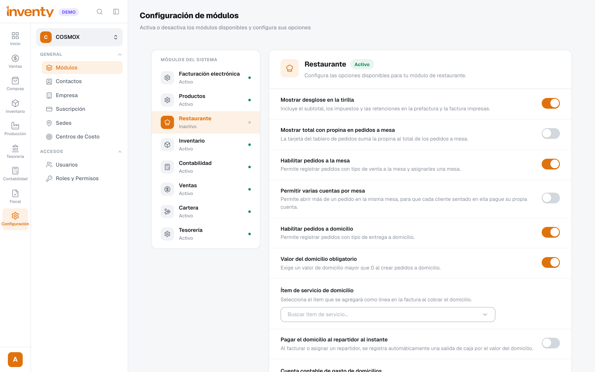
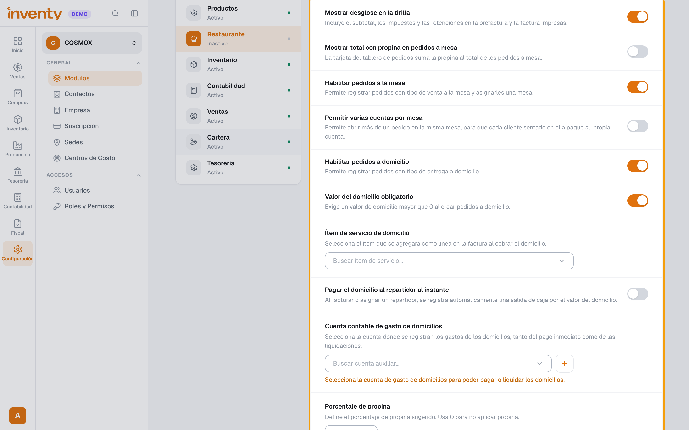
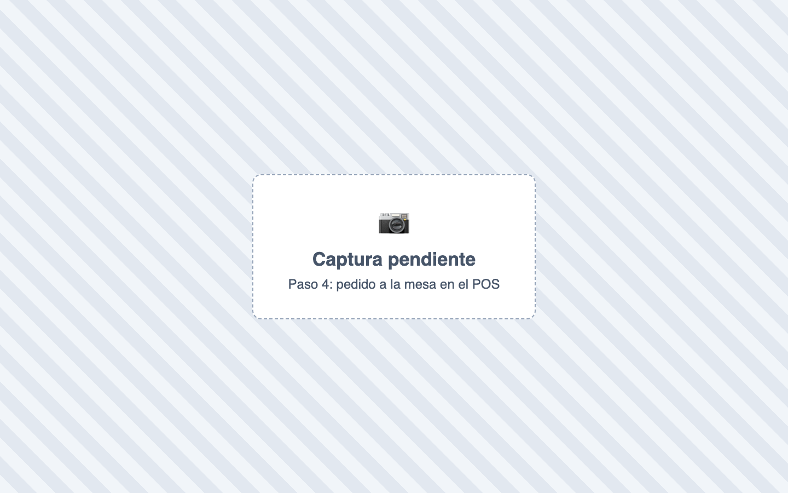
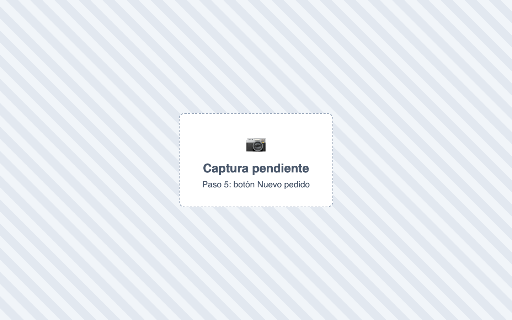

# ¿Cómo activo varias cuentas en una misma mesa?

También se busca como: varias cuentas por mesa, cuentas separadas, dividir la cuenta, separar cuenta, cada uno paga lo suyo, cuenta aparte, dos pedidos en la misma mesa, mesa ocupada, split.

## Pasos

**Paso 1.** Ingresa a Configuración › Módulos y selecciona **Restaurante**.

**Paso 2.** Activa **Habilitar pedidos a la mesa**.

**Paso 3.** Debajo aparece **Permitir varias cuentas por mesa**: actívala.

**Paso 4.** En el POS, elige **A la mesa**, **Seleccionar mesa**, agrega lo del primer cliente y haz clic en **Realizar pedido**.

**Paso 5.** Haz clic en **Nuevo pedido** (**+**), elige **A la mesa** y **la misma mesa**, agrega lo del segundo cliente y **Realizar pedido**. Repite por cada cliente.

✅ **Listo:** la mesa queda con varias cuentas y cada cliente paga la suya. Usa **Renombrar pedido** para identificarlas (ej. *Mesa 4 — María*).

## Si algo falla

| Problema | Solución |
|---|---|
| No sale **Permitir varias cuentas por mesa** | Primero activa **Habilitar pedidos a la mesa**. |
| *La mesa seleccionada ya está ocupada por otro pedido…* | La opción está apagada. Actívala y recarga el POS. |
| No aparece el módulo Restaurante | No está en tu plan o tu rol no tiene permiso. |
| *Sin mesas disponibles* | Crea las mesas en Restaurante › Mesas. |
| Dividir una cuenta ya abierta | [PENDIENTE DE VALIDACIÓN FUNCIONAL: si se pueden mover productos entre pedidos.] Crea las cuentas separadas desde el inicio. |

## Relacionados

- [¿Cómo manejo los domicilios?](domicilios.md)
- [Todas las opciones de Módulos](../primeros-pasos/opciones-modulos.md)
