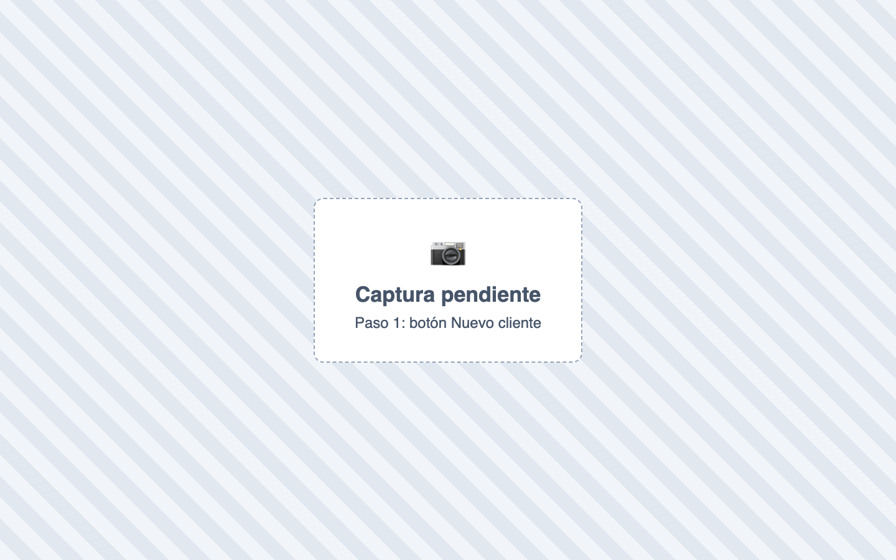
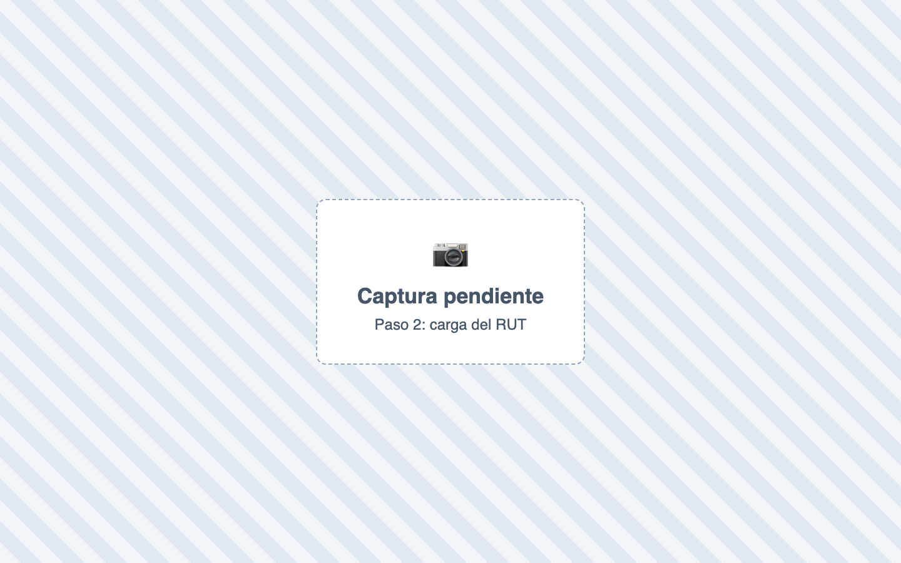
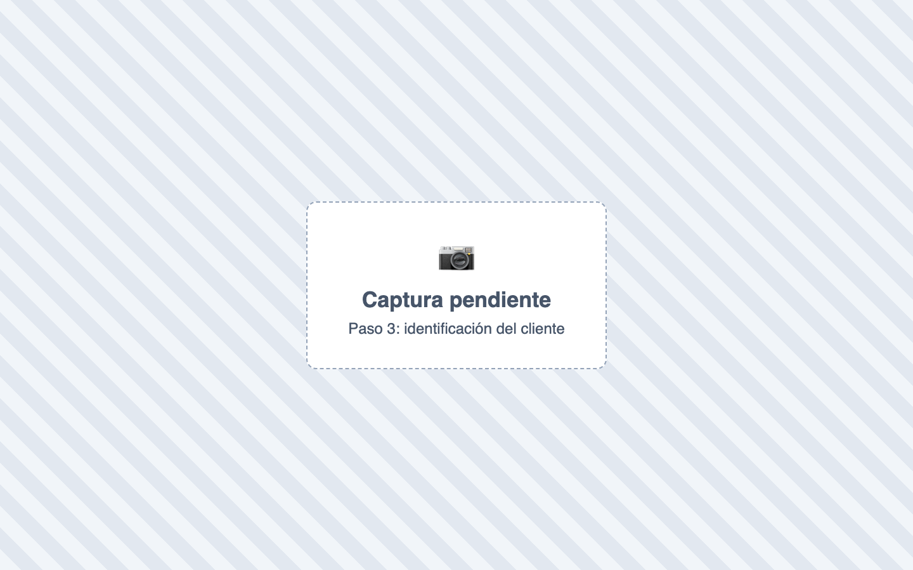
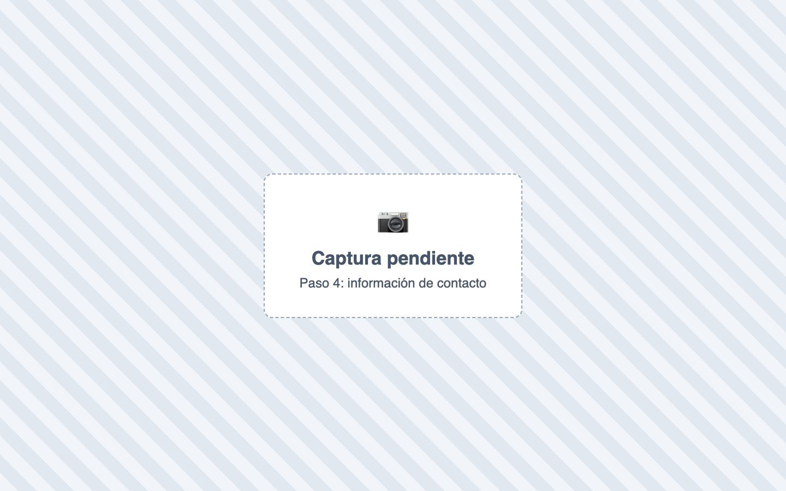
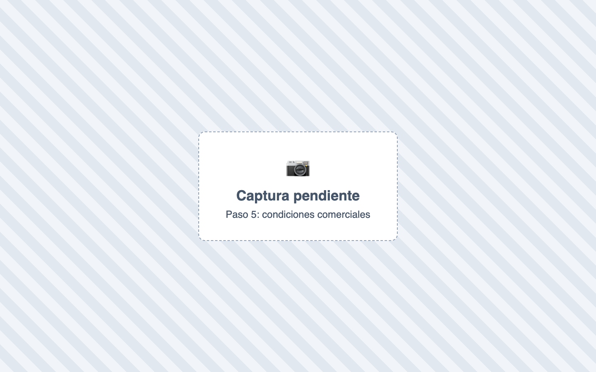
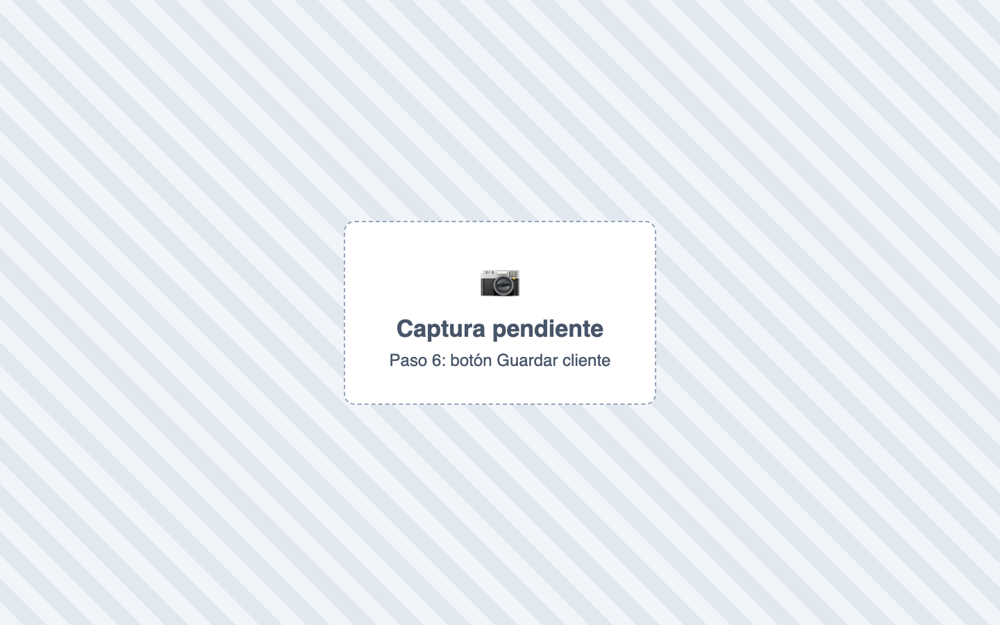

# ¿Cómo creo un cliente?

También se busca como: registrar cliente, nuevo cliente, agregar comprador, datos del cliente, NIT del cliente, cupo de crédito, RUT.

**Antes de empezar:** ten el RUT del cliente en PDF o sus datos.

## Pasos

**Paso 1.** Ingresa a Ventas › Clientes y haz clic en **Nuevo cliente**.

**Paso 2.** (Recomendado) Adjunta el **RUT en PDF**: Inventy completa los datos solo. Revísalos.

**Paso 3.** Completa **Tipo de documento**, **Número de documento** y el nombre o **Razón social**.

**Paso 4.** En **Información de contacto**, escribe el correo (para facturas electrónicas), teléfonos, **Sede** y dirección.

**Paso 5.** En **Datos del rol de cliente**, define **Límite de crédito** (0 = sin crédito), **Plazo de pago (días)**, vendedor, tipo de cliente y retención.

**Paso 6.** Haz clic en **Guardar cliente**.

✅ **Listo:** el cliente ya se puede elegir en el POS y en las facturas.

## Si algo falla

| Problema | Solución |
|---|---|
| *Este número de documento ya está registrado para este tipo de identificación.* | El cliente ya existe: búscalo por documento. |
| *El número de identificación contiene caracteres no válidos.* | Escribe sin puntos, comas ni espacios. |
| *No pudimos leer el RUT…* | Escribe los datos a mano. |
| *Este cliente no tiene cupo de crédito disponible.* | Sube el **Límite de crédito** o vende de contado. |
| El cliente no debe recibir factura electrónica | Marca **No genera documentos electrónicos**. |

## Relacionados

- [¿Cómo hago una factura de venta?](crear-factura-venta.md)
- [¿Cómo se aplican las retenciones?](../impuestos/retenciones.md)
