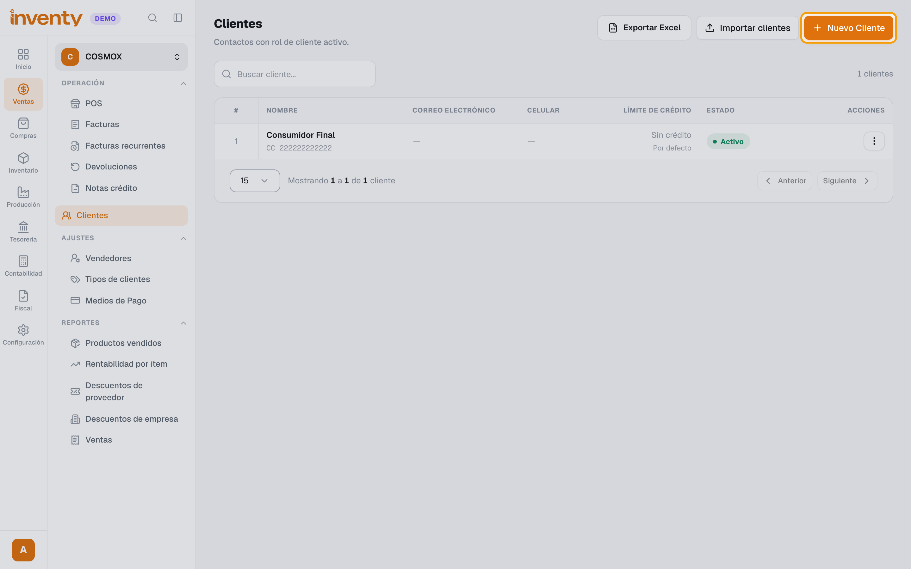
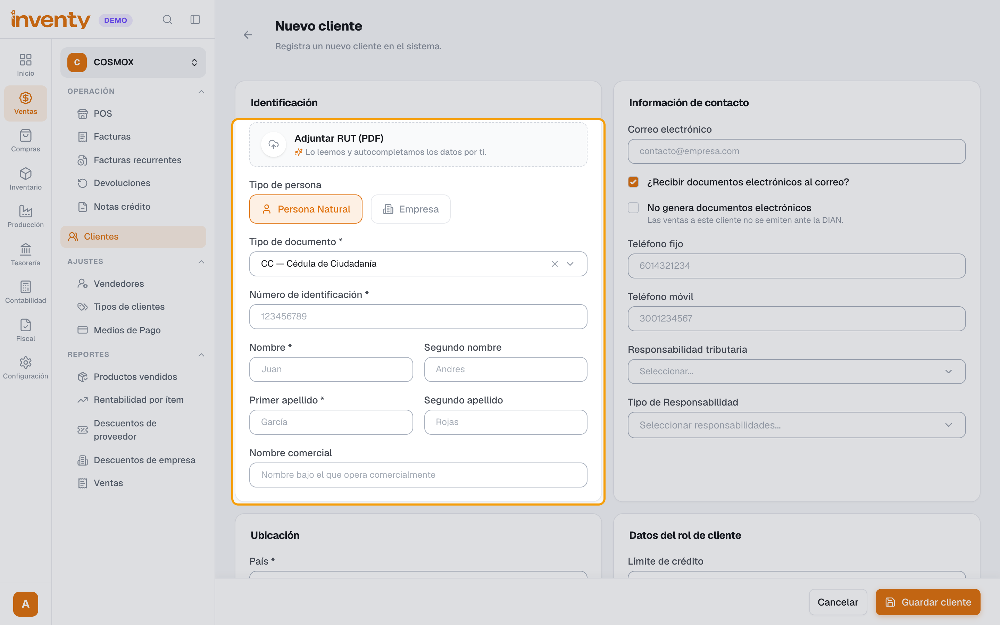
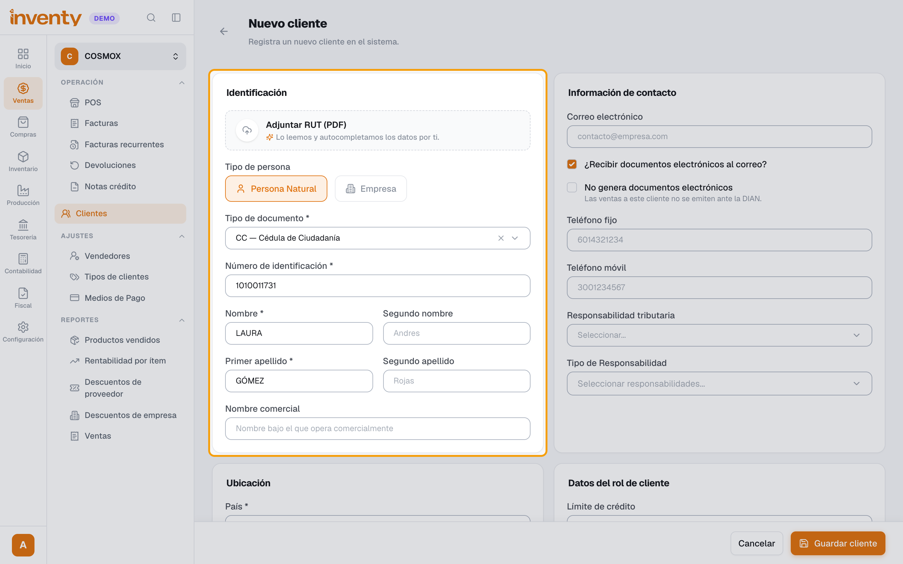
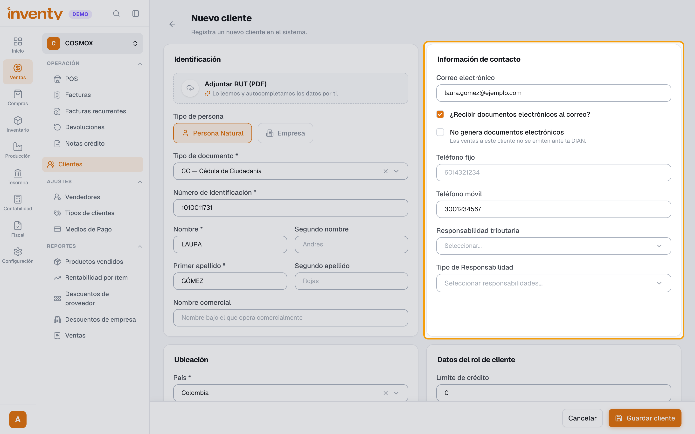
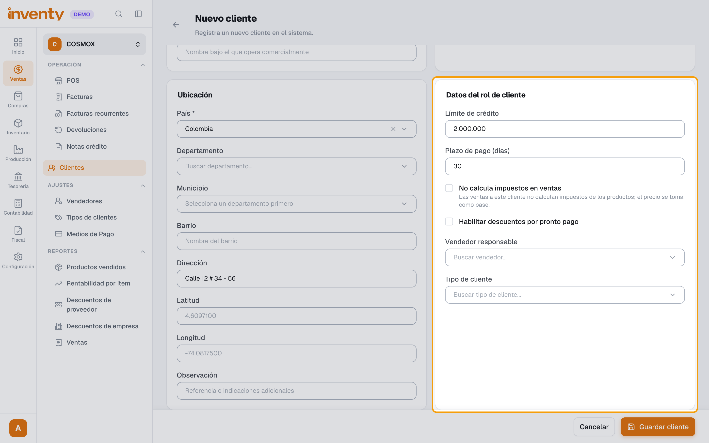
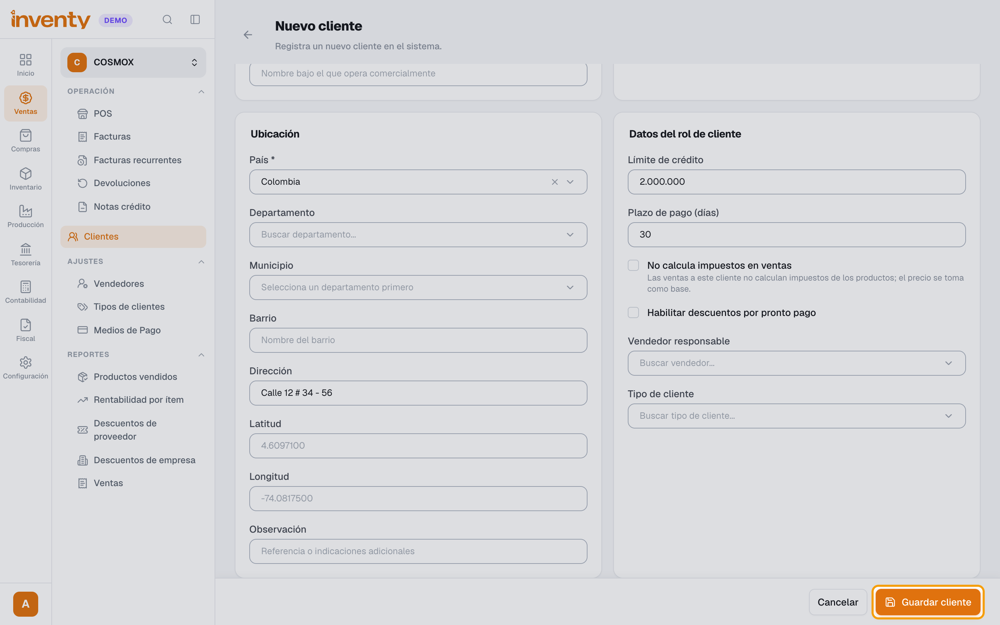

# ¿Cómo creo un cliente?

También se busca como: registrar cliente, nuevo cliente, agregar comprador, datos del cliente, NIT del cliente, cupo de crédito, RUT.

**Antes de empezar:** ten el RUT del cliente en PDF o sus datos.

## Pasos

**Paso 1.** Ingresa a Ventas › Clientes y haz clic en **Nuevo Cliente**.

**Paso 2.** (Recomendado) Adjunta el **RUT en PDF**: Inventy completa los datos solo. Revísalos.

**Paso 3.** En **Identificación**, completa el tipo y **Número de identificación**, y el **Nombre** y **Primer apellido** (o la razón social si es empresa).

**Paso 4.** En **Información de contacto** escribe el **Correo electrónico** (para facturas electrónicas) y los teléfonos; en **Ubicación**, la **Dirección** y el barrio.

**Paso 5.** En **Datos del rol de cliente**, define **Límite de crédito** (0 = sin crédito), **Plazo de pago (días)** y el **Tipo de cliente** (obligatorio para vender a crédito si usas Contabilidad: de ahí sale la cuenta por cobrar). Si aplica, marca **No calcula impuestos en ventas** y configura sus **Retenciones**.

**Paso 6.** Haz clic en **Guardar cliente**.

✅ **Listo:** el cliente ya se puede elegir en el POS y en las facturas.

## Si algo falla

| Problema | Solución |
|---|---|
| Es extranjero con NIT | Elige el tipo **NIT-E**: acepta letras, números y guion (hasta 20 caracteres). |
| *Este número de documento ya está registrado para este tipo de identificación.* | El cliente ya existe: búscalo por documento. |
| *El número de identificación contiene caracteres no válidos.* | Escribe sin puntos, comas ni espacios. |
| *No pudimos leer el RUT…* | Escribe los datos a mano. |
| *Este cliente no tiene cupo de crédito disponible.* | Sube el **Límite de crédito** o vende de contado. |
| Al facturar a crédito: *Configura una cuenta de cuentas por cobrar en el tipo de cliente…* | Asígnale un [tipo de cliente](tipos-de-cliente.md) con **Cuenta por cobrar**. Luego abre la factura con **Editar** y valídala desde ahí. |
| El cliente no debe recibir factura electrónica | Marca **No genera documentos electrónicos**. |
| Al cliente no se le cobra IVA | Marca **No calcula impuestos en ventas**: el precio se toma como base. |

## Relacionados

- [¿Cómo hago una factura de venta?](crear-factura-venta.md)
- [¿Cómo se aplican las retenciones?](../impuestos/retenciones.md)
- [¿Cómo manejo las listas de precios?](listas-de-precios.md)
