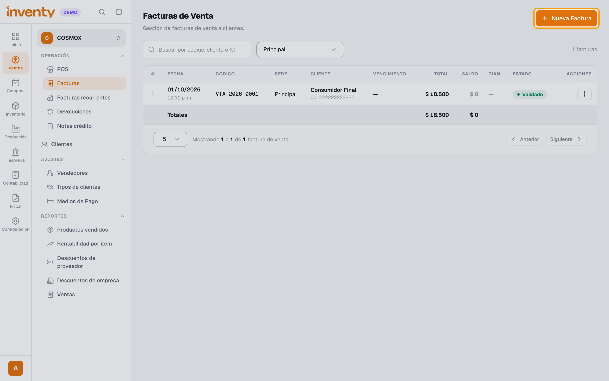
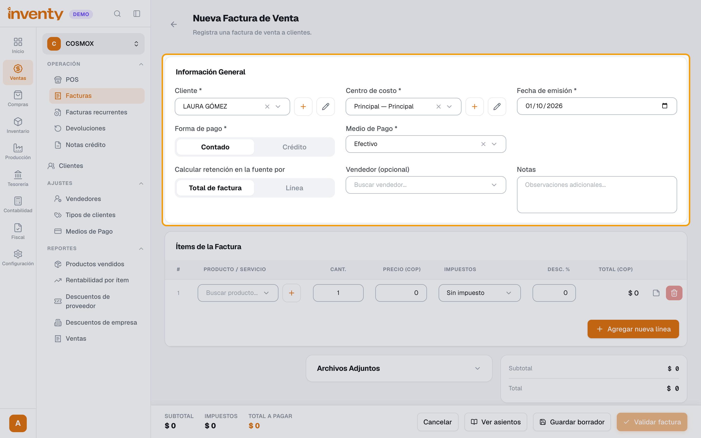
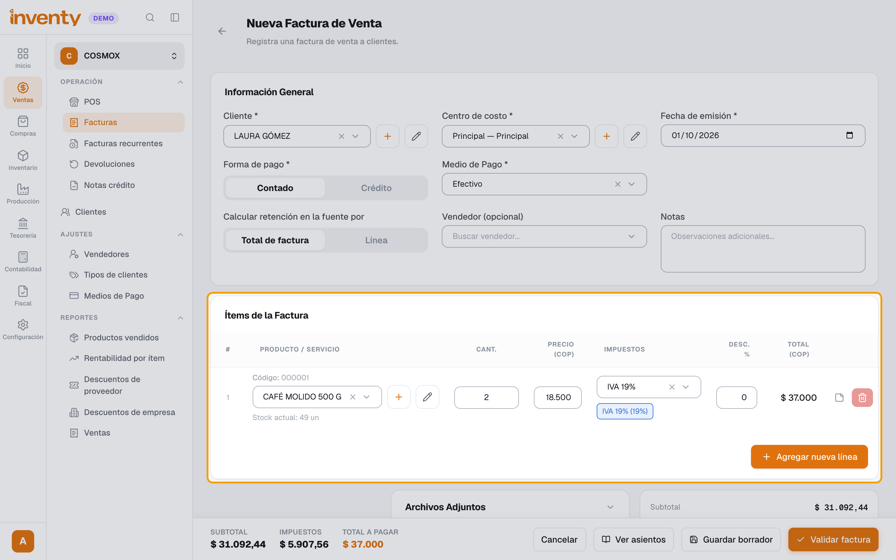
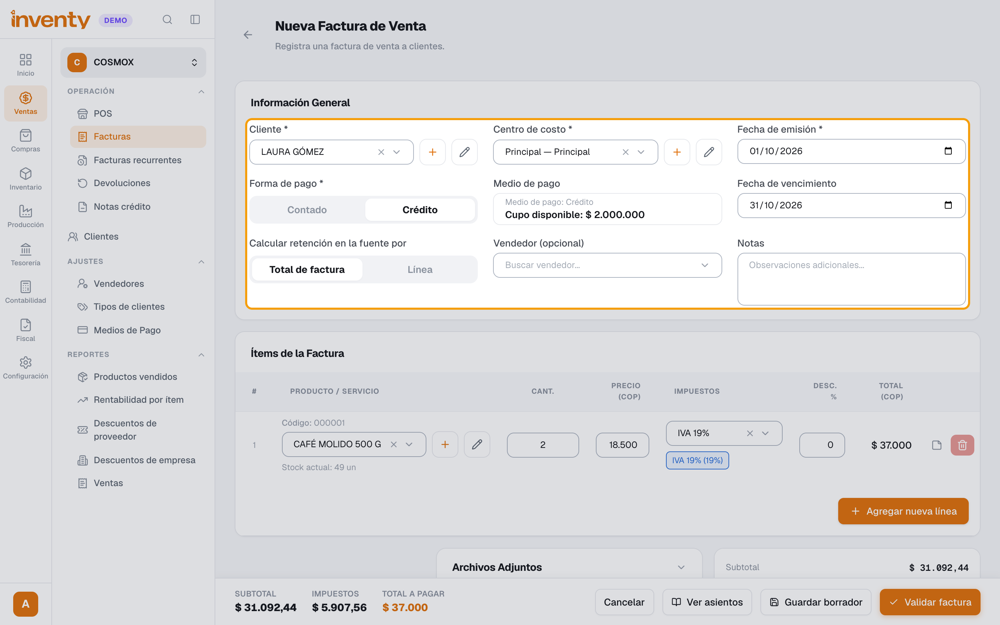
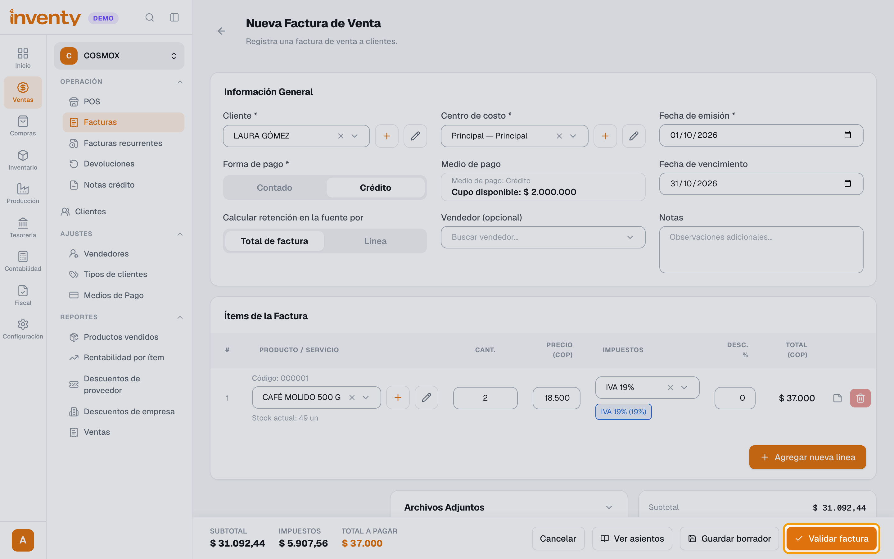
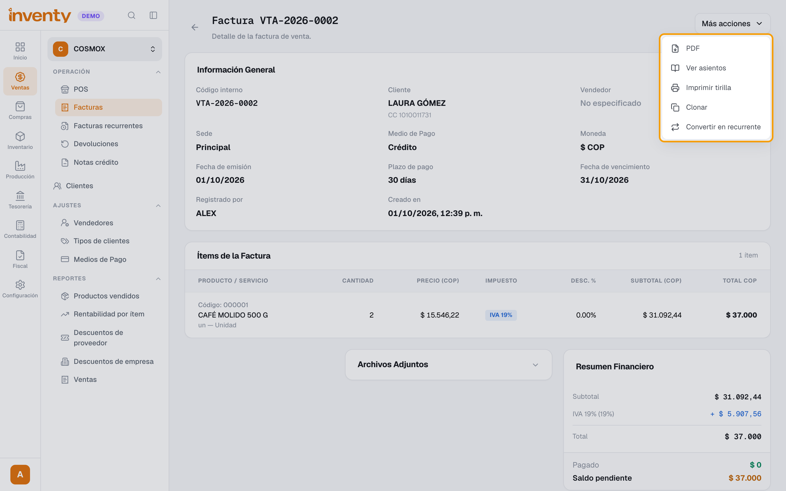

# ¿Cómo hago una factura de venta?

También se busca como: facturar, crear factura, nueva factura, factura a crédito, cuenta de cobro, vender a crédito, factura de contado.

**Antes de empezar:** el cliente y los productos deben existir.

!!! warning "Si vas a vender a crédito"
    Si tu empresa usa Contabilidad, el cliente debe tener un **Tipo de cliente** con **Cuenta por cobrar** (en su ficha: **Editar › Datos del rol de cliente › Tipo de cliente**). Si no, al validar sale *“Configura una cuenta de cuentas por cobrar en el tipo de cliente para facturar a crédito con contabilidad activa.”* Ver [cómo solucionarlo](../soluciones-rapidas/ventas.md#al-validar-la-factura-a-credito-me-pide-configurar-la-cuenta-contable).

## Pasos

**Paso 1.** Ingresa a Ventas › Facturas y haz clic en **Nueva Factura**.

**Paso 2.** En **Información General**, elige **Cliente**, **Centro de costo** y **Fecha de emisión**.

**Paso 3.** En **Ítems de la Factura**, elige el producto en **Buscar producto...** y escribe la cantidad. El precio, el impuesto y el descuento se llenan solos. Usa **Agregar nueva línea** para más productos.

**Paso 4.** Elige **Forma de pago**: **Contado** (con su **Medio de Pago**) o **Crédito** (verás el **Cupo disponible** y la **Fecha de vencimiento**). Hazlo **después** de agregar los productos.

**Paso 5.** Revisa el **Total a pagar** y haz clic en **Validar factura**. Confirma en **¿Validar factura?**

**Paso 6.** En el detalle, **Más acciones** tiene **PDF**, **Ver asientos**, **Imprimir tirilla**, **Clonar** y **Convertir en recurrente**. Si tu empresa factura electrónicamente y no se envió sola, ahí también verás **Emitir electrónica** ([guía](../facturacion-electronica/emitir-factura-electronica.md)).

✅ **Listo:** la factura queda **Validada** (o **Pagada**) y afecta inventario, cartera y contabilidad. Ya no se puede editar.

!!! tip "¿Aún no estás seguro?"
    Usa **Guardar borrador**: queda guardada sin afectar nada y la puedes terminar después.

## Si algo falla

| Problema | Solución |
|---|---|
| *La fecha de emisión no puede ser una fecha futura.* | Usa hoy o una fecha anterior. |
| *El monto a crédito debe ser igual al total de la factura.* | Elegiste **Crédito** antes de agregar o cambiar productos. Haz clic en **Contado** y otra vez en **Crédito** para recalcular. |
| *Este cliente no tiene cupo de crédito disponible.* | Sube su cupo o factura de contado. |
| A crédito: *Configura una cuenta de cuentas por cobrar en el tipo de cliente…* | El cliente no tiene tipo de cliente o el tipo no tiene **Cuenta por cobrar**. Ver [solución](../soluciones-rapidas/ventas.md#al-validar-la-factura-a-credito-me-pide-configurar-la-cuenta-contable). |
| *El asiento contable no está balanceado* | Usa **Ver asientos**: la línea sin cuenta dice qué falta. Si dice *Configura la cuenta por cobrar en el tipo de cliente*, asígnale al cliente un [tipo de cliente](tipos-de-cliente.md) con cuenta por cobrar. |
| *El centro de costo es obligatorio.* | Crea uno en Configuración › Centros de Costo. |
| Me equivoqué en una factura validada | Haz una [devolución](devolucion-venta.md). Anular solo es posible si no movió inventario. |

## Relacionados

- [¿Cómo emito una factura electrónica?](../facturacion-electronica/emitir-factura-electronica.md)
- [¿Cómo registro un pago de un cliente?](../finanzas/registrar-ingreso.md)
