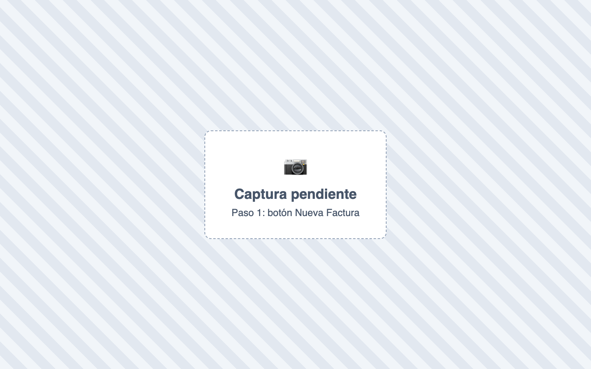
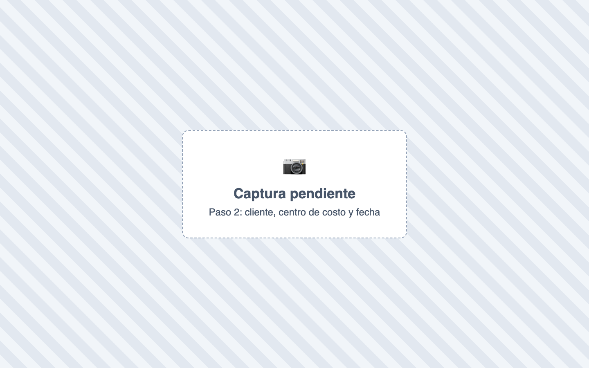
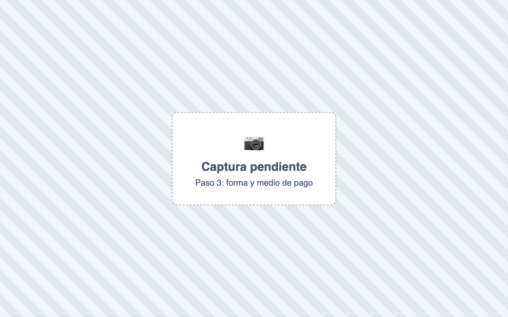
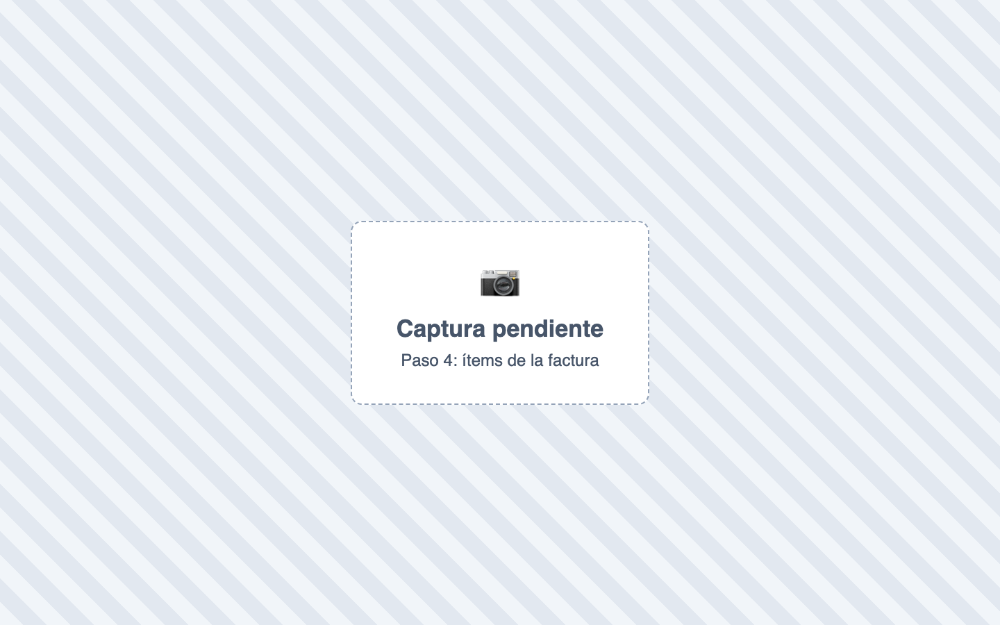
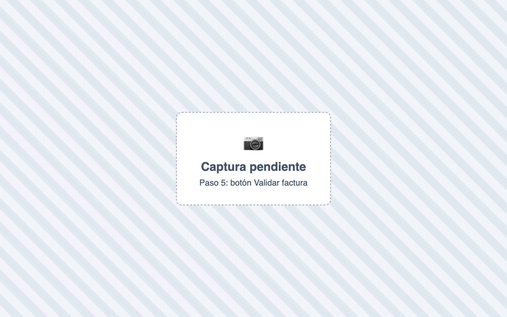
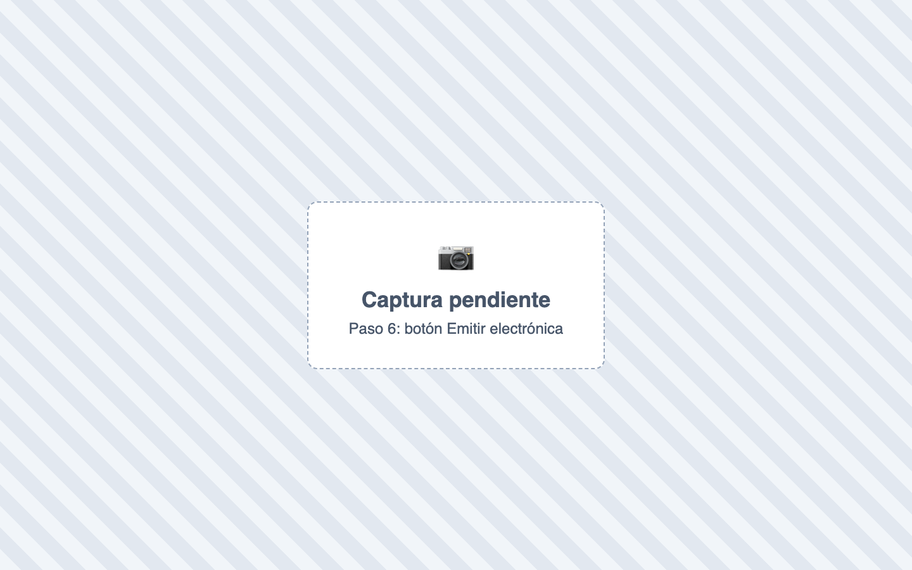

# ¿Cómo hago una factura de venta?

También se busca como: facturar, crear factura, nueva factura, factura a crédito, cuenta de cobro, vender a crédito, factura de contado.

**Antes de empezar:** el cliente y los productos deben existir.

## Pasos

**Paso 1.** Ingresa a Ventas › Facturas y haz clic en **Nueva Factura**.

**Paso 2.** En **Información General**, elige **Cliente**, **Centro de costo** y **Fecha de emisión**.

**Paso 3.** Elige **Forma de pago** (**Contado** o **Crédito**) y el **Medio de Pago**. En crédito, revisa la **Fecha de vencimiento**.

**Paso 4.** En **Ítems de la Factura**, haz clic en **Agregar ítem** y registra cada producto con cantidad y precio.

**Paso 5.** Revisa el **Total a pagar** y haz clic en **Validar factura**. Confirma en **¿Validar factura?**

**Paso 6.** Si no se envió sola a la DIAN, en el detalle haz clic en **Emitir electrónica**.

✅ **Listo:** la factura queda **Validada** (o **Pagada**) y afecta inventario, cartera y contabilidad. Ya no se puede editar.

!!! tip "¿Aún no estás seguro?"
    Usa **Guardar borrador**: queda guardada sin afectar nada y la puedes terminar después.

## Si algo falla

| Problema | Solución |
|---|---|
| *La fecha de emisión no puede ser una fecha futura.* | Usa hoy o una fecha anterior. |
| *Este cliente no tiene cupo de crédito disponible.* | Sube su cupo o factura de contado. |
| *El asiento contable no está balanceado* | Falta una cuenta contable: revisa con tu contador. |
| *El centro de costo es obligatorio.* | Crea uno en Configuración › Centros de Costo. |
| Me equivoqué en una factura validada | Haz una [devolución](devolucion-venta.md). Anular solo es posible si no movió inventario. |

## Relacionados

- [¿Cómo emito una factura electrónica?](../facturacion-electronica/emitir-factura-electronica.md)
- [¿Cómo registro un pago de un cliente?](../finanzas/registrar-ingreso.md)
