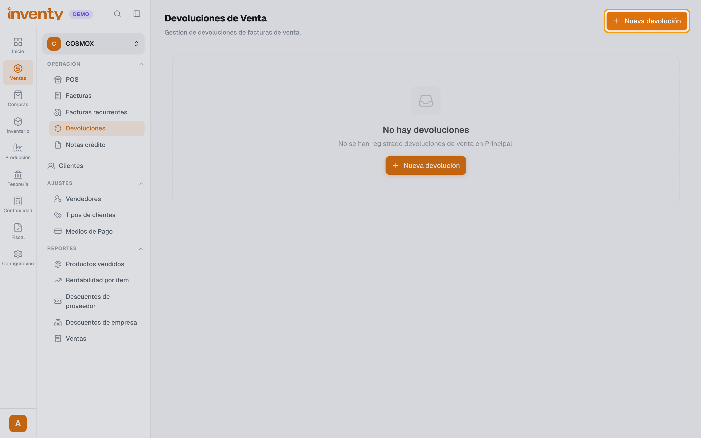
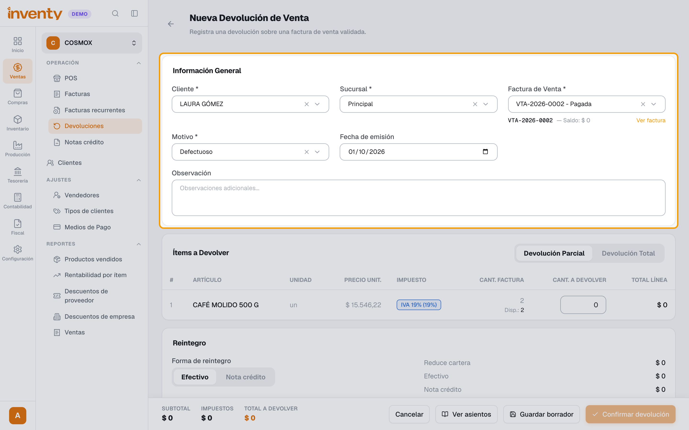
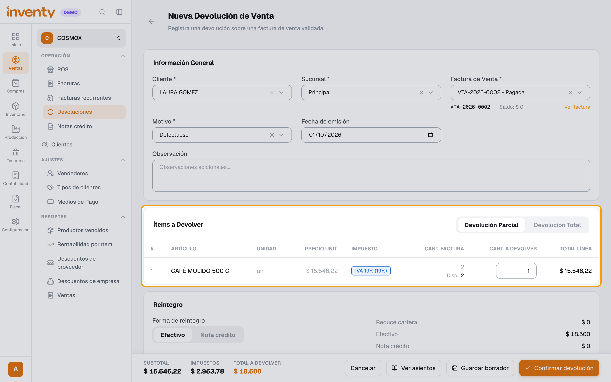
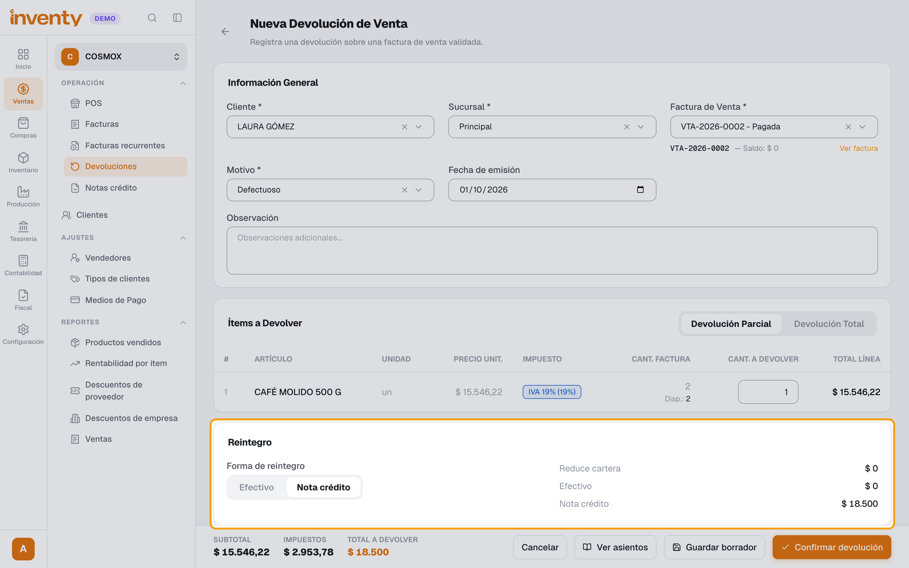
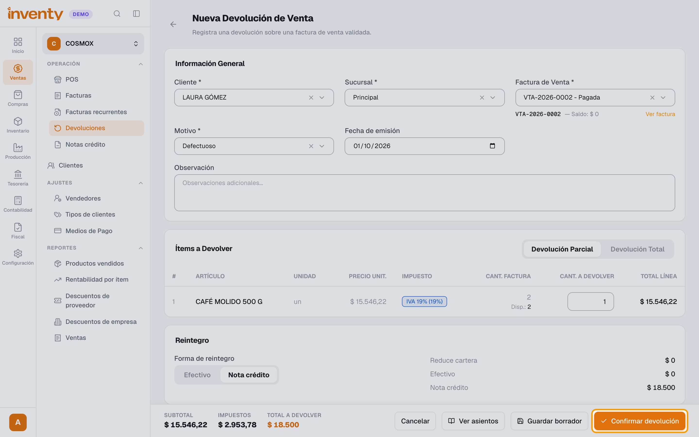

# ¿Cómo registro una devolución de venta?

También se busca como: devolución, cliente devuelve, cambio de producto, nota crédito, reversar venta, producto defectuoso.

**Antes de empezar:** la factura debe estar **Validada**.

## Pasos

**Paso 1.** Ingresa a Ventas › Devoluciones y crea una **Nueva devolución**.

**Paso 2.** Elige **Cliente**, **Sucursal**, **Factura de Venta** y **Motivo**.

**Paso 3.** En **Ítems a Devolver**, elige **Devolución Parcial** o **Devolución Total**. En parcial, escribe la **Cant. a devolver** de cada producto.

**Paso 4.** En **Reintegro**, elige cómo le devuelves el dinero al cliente: **Efectivo** (sale de tu caja) o **Nota crédito** (queda como saldo a favor para su próxima compra). Revisa **Reduce cartera**, **Efectivo** y **Nota crédito**.

**Paso 5.** Revisa el **Total a devolver**, haz clic en **Confirmar devolución** y confirma.

✅ **Listo:** la devolución queda **Confirmada**, el inventario vuelve y la factura muestra *Devolución total* o *parcial*. Si elegiste **Nota crédito**, el cliente queda con saldo a favor (Ventas › Notas crédito). Si emites automático, se envía la nota crédito electrónica a la DIAN.

## Si algo falla

| Problema | Solución |
|---|---|
| No aparece la factura | Elige primero el **Cliente**. Solo salen facturas validadas. |
| *No hay una resolución activa de nota crédito disponible para esta sucursal.* | Registra una [resolución](../facturacion-electronica/resoluciones.md) para nota crédito. |
| La nota crédito fue rechazada | Ver [documento rechazado](../facturacion-electronica/documento-rechazado.md). |

## Relacionados

- [¿Cómo hago una factura de venta?](crear-factura-venta.md)
