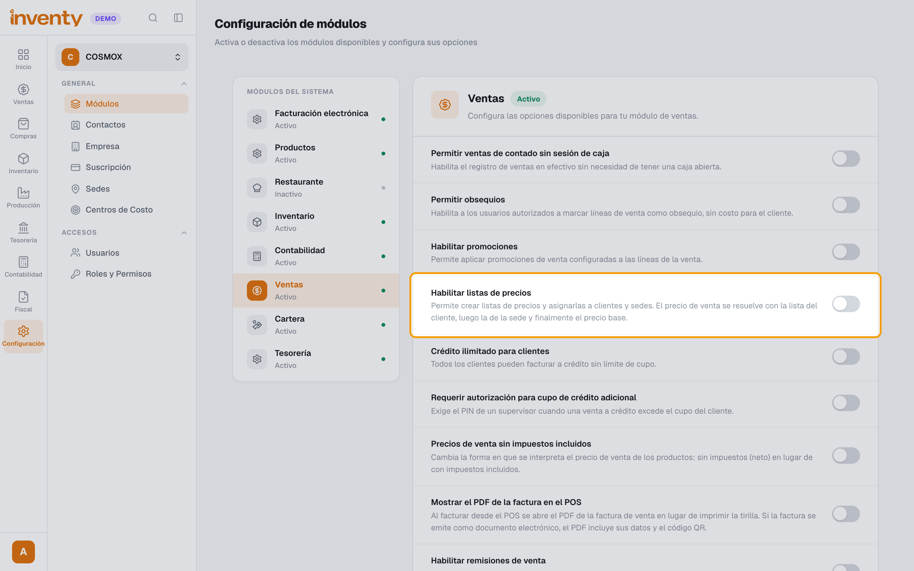
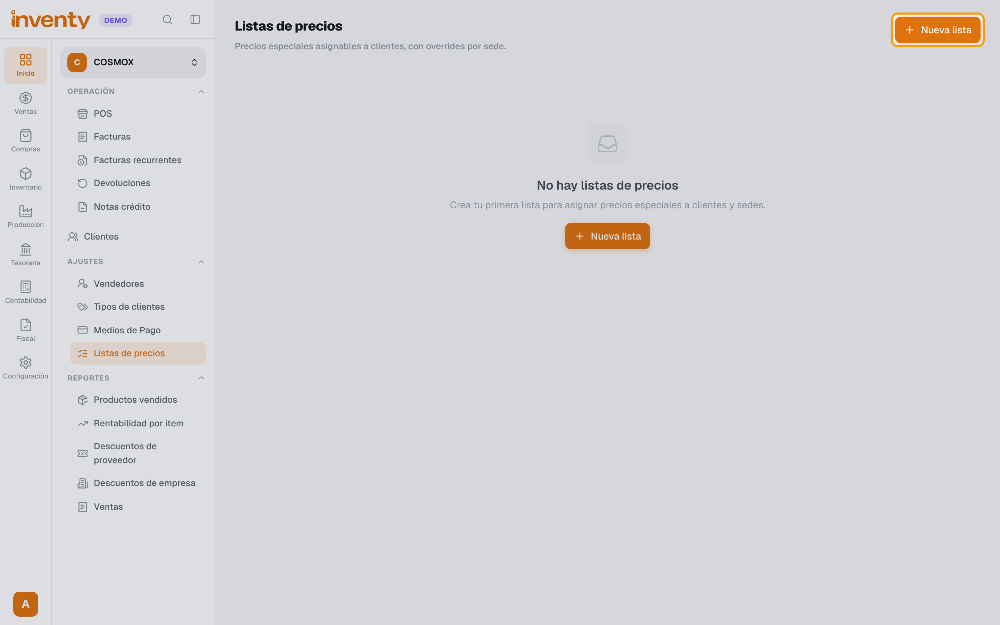
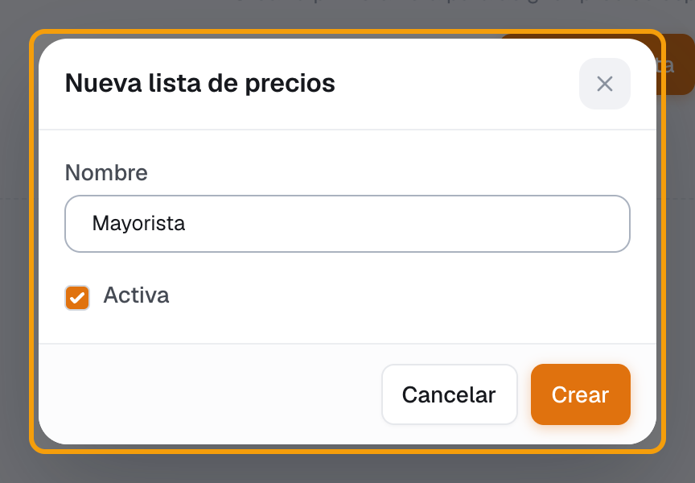
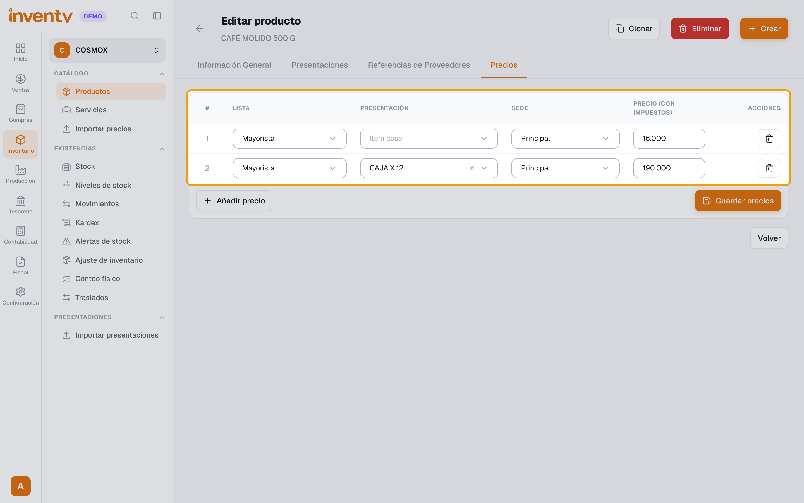
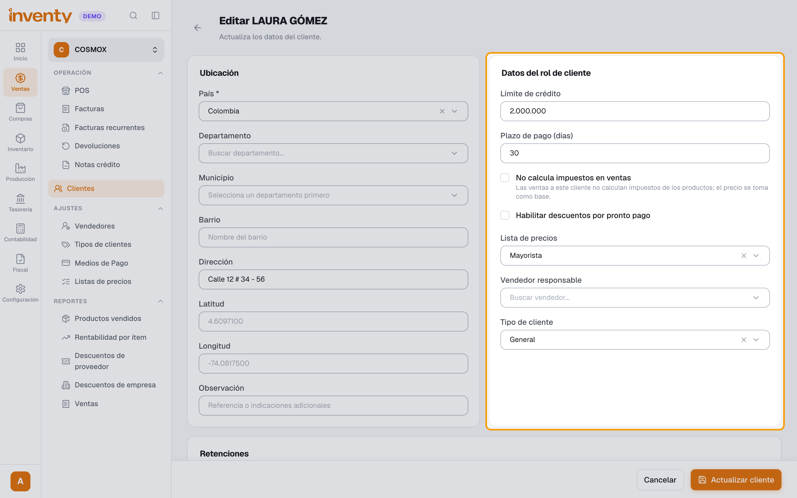
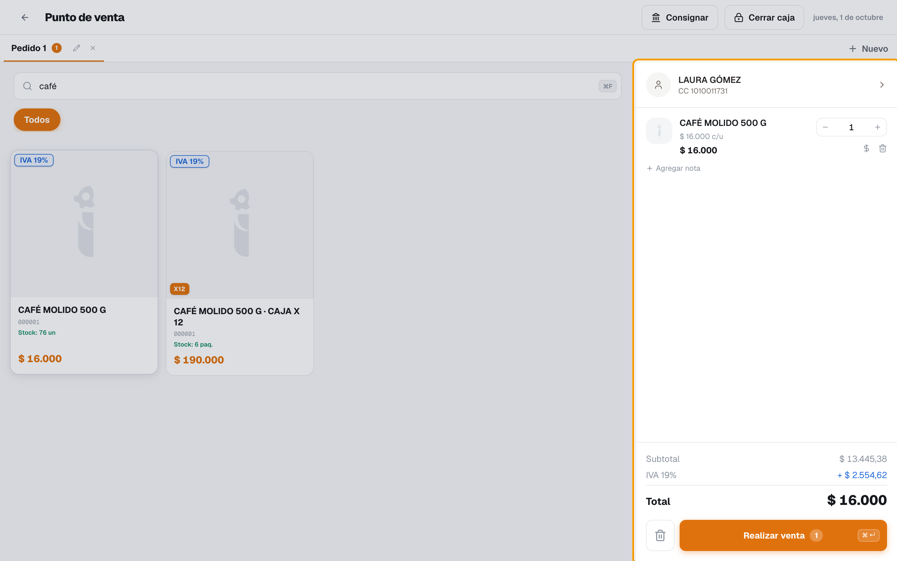
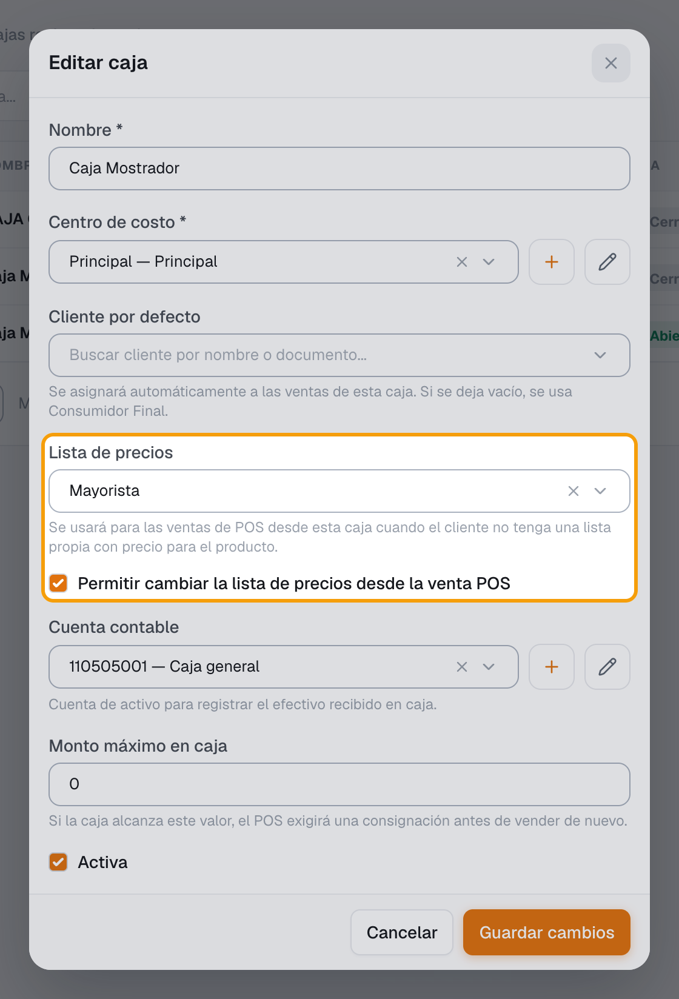
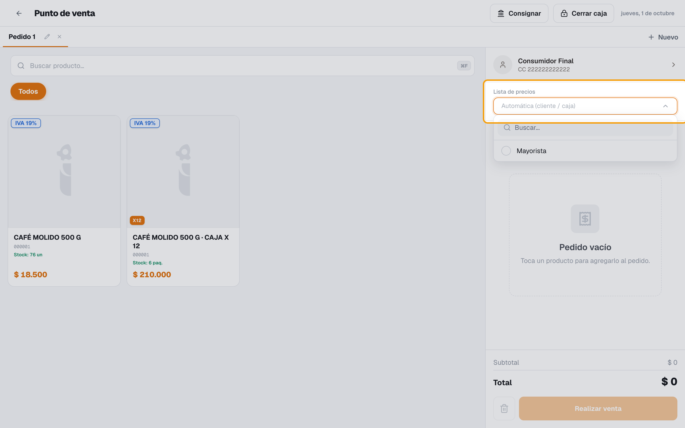

# ¿Cómo manejo las listas de precios?

También se busca como: lista de precios, precio mayorista, precio especial, precio por cliente, precio diferente, tarifa, precio por sede, precio por caja.

**Qué es:** un grupo de precios especiales (ej. *Mayorista*) que se asigna a un **cliente** o a una **caja**. Cada precio de la lista es para un producto (o una presentación) **en una sede**.

## Pasos

**Paso 1.** Activa la opción (una sola vez): ingresa a Configuración › Módulos, elige **Ventas** y enciende **Habilitar listas de precios**. Se guarda solo.

**Paso 2.** Ingresa a Ventas › Ajustes › Listas de precios y haz clic en **Nueva lista**.

**Paso 3.** Escribe el **Nombre** (ej. *Mayorista*), deja **Activa** marcada y haz clic en **Crear**.

**Paso 4.** Dale precio a cada producto: en Inventario › Productos abre el producto, haz clic en **Editar producto** y abre la pestaña **Precios**. Por cada precio haz clic en **Añadir precio**, elige la **Lista**, la **Presentación** (*Ítem base* es la unidad; o una caja, ej. *CAJA X 12*), la **Sede** y escribe el **Precio (con impuestos)**. Haz clic en **Guardar precios**. Si vendes en varias sedes, agrega una fila por sede.

**Paso 5.** Asigna la lista al cliente: en Ventas › Clientes abre el cliente, haz clic en **Editar**, elige la **Lista de precios** en **Datos del rol de cliente** y haz clic en **Actualizar cliente**.

**Paso 6.** Vende normal. Al elegir ese cliente en el POS o en la factura, los productos salen con el precio de su lista (ej. café a *$16.000* en vez de *$18.500*).

**Paso 7.** (Opcional) Configura la caja: en Tesorería › Caja › Cajas › **Acciones › Editar**:

- **Lista de precios**: la usa el POS de esa caja cuando el cliente no tiene lista con precio para el producto.
- **Permitir cambiar la lista de precios desde la venta POS**: deja que el cajero elija la lista en cada venta.

Haz clic en **Guardar cambios**.

**Paso 8.** (Opcional) Si la caja lo permite, en el POS aparece **Lista de precios** debajo del cliente. Por defecto dice **Automática (cliente / caja)**; ábrela y elige otra lista (ej. *Mayorista*) solo para esa venta.

✅ **Listo:** cada vez que le vendas a ese cliente, Inventy usa los precios de su lista.

## ¿Qué precio cobra Inventy?

Para cada producto de la venta, en este orden (usa el primero que encuentre):

| Orden | POS | Factura de venta |
|---|---|---|
| — | Si el cajero **eligió una lista** en la venta (paso 8): se usa **solo esa**; lo que no tenga precio en ella sale a precio base | — (no aplica) |
| 1 | Precio de la **lista del cliente** para ese producto y tu sede | Igual |
| 2 | Precio de la **lista de la caja** abierta | — (no aplica) |
| 3 | **Precio base** del producto (o de la presentación) | Precio base |

- La caja tiene su **propio precio** en la lista. Si no le pones precio a *CAJA X 12*, la caja sale a su precio base aunque la unidad tenga precio en la lista.
- Si el cliente tiene un **tipo de cliente con descuento**, el descuento se aplica **encima** del precio de la lista.
- Una lista **desactivada** se ignora: se cobra el precio base (el cliente la conserva asignada).
- Si apagas **Habilitar listas de precios**, todo vuelve al precio base.

## Si algo falla

| Problema | Solución |
|---|---|
| No aparece **Listas de precios** en el menú | Activa **Habilitar listas de precios** en Configuración › Módulos › Ventas (paso 1). |
| No aparece la pestaña **Precios** en el producto | La misma opción del paso 1 está apagada. |
| *La sede es requerida.* | Elige la **Sede** en cada fila del precio. |
| *La lista de precios es requerida.* | Elige la **Lista** en la fila o bórrala con el ícono de la papelera. |
| *Ya existe un precio para esta lista/presentación/sede.* | Ese precio ya está creado: cámbialo en su fila en vez de agregar otro. |
| El cliente sigue saliendo con el precio normal | Revisa que el cliente tenga la lista en su ficha, que la lista esté **Activa** y que el producto (o esa presentación) tenga precio en esa lista **para tu sede**. |
| No aparece **Lista de precios** en el POS | La caja no tiene marcada **Permitir cambiar la lista de precios desde la venta POS** (paso 7). |
| En la factura no toma la lista de la caja | Es normal: la lista de la caja solo aplica en el POS. Asigna la lista al cliente. |
| ¿Lista de precios o tipo de cliente? | **Lista**: precios fijos por producto. **Tipo de cliente**: un % de descuento para todo. Se pueden usar juntos. |
| Son muchos productos | Usa Inventario › Importar precios. |

## Relacionados

- [¿Cómo manejo las presentaciones de compra y de venta?](../productos-inventario/presentaciones.md)
- [¿Cómo creo un cliente?](crear-cliente.md)
- [¿Cómo creo un tipo de cliente?](tipos-de-cliente.md)
- [¿Cómo vendo en el POS?](../pos/vender-en-pos.md)
