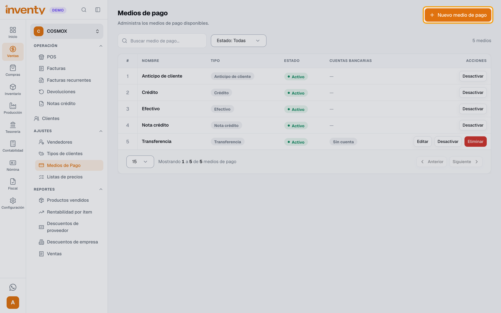
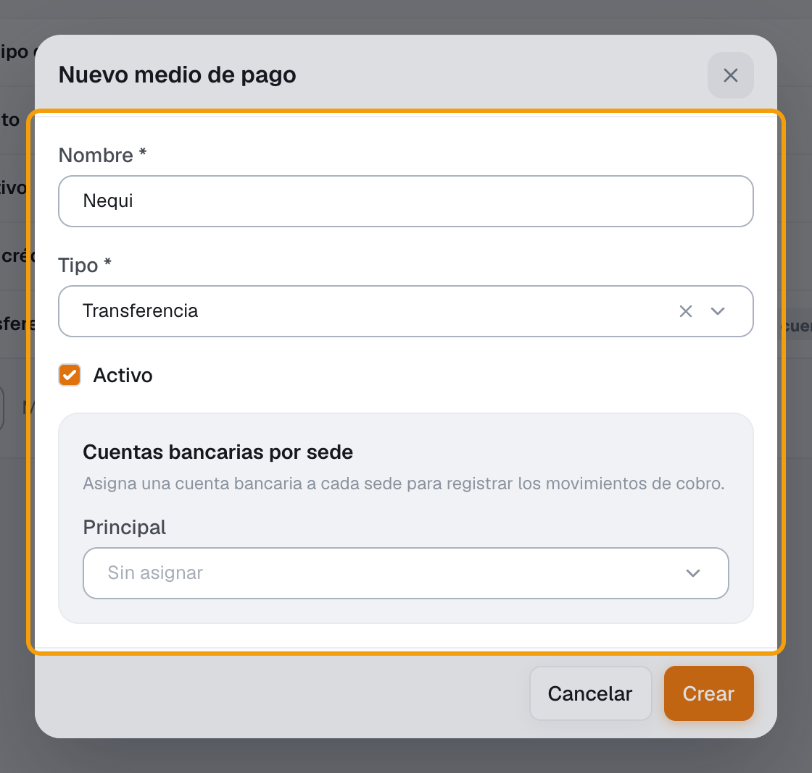
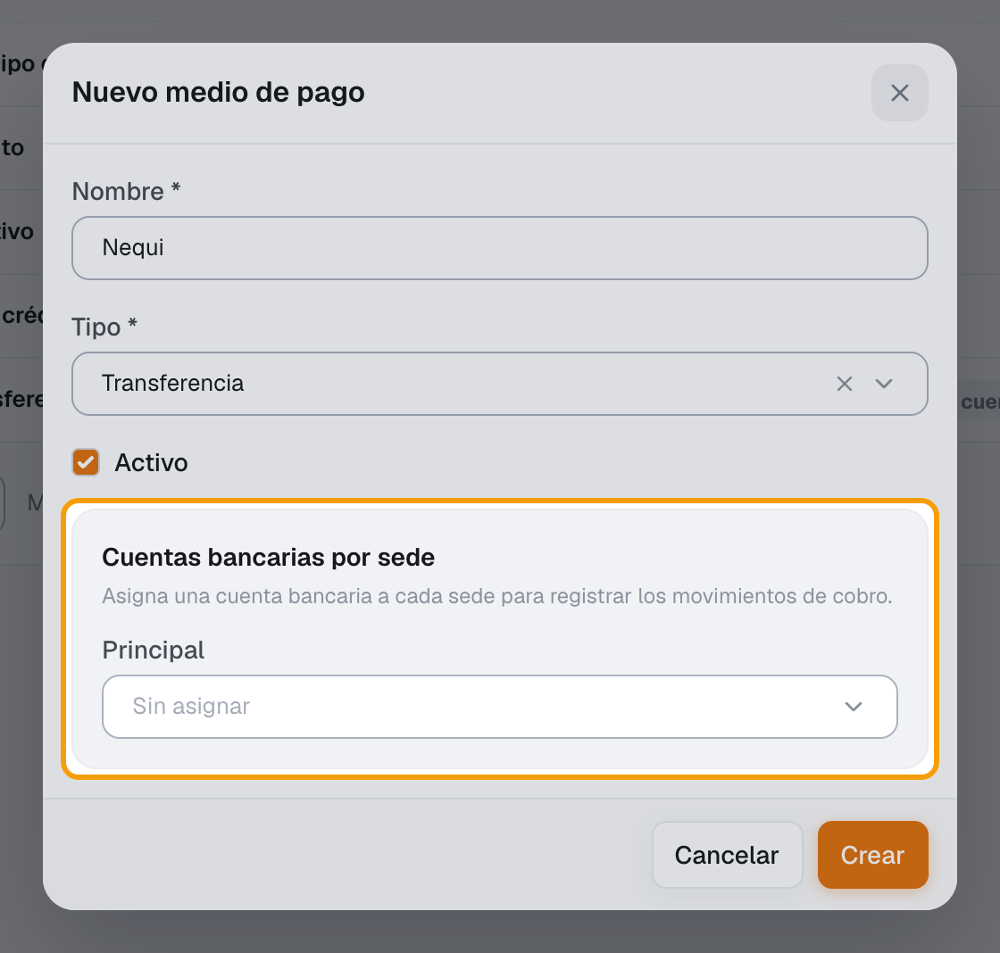
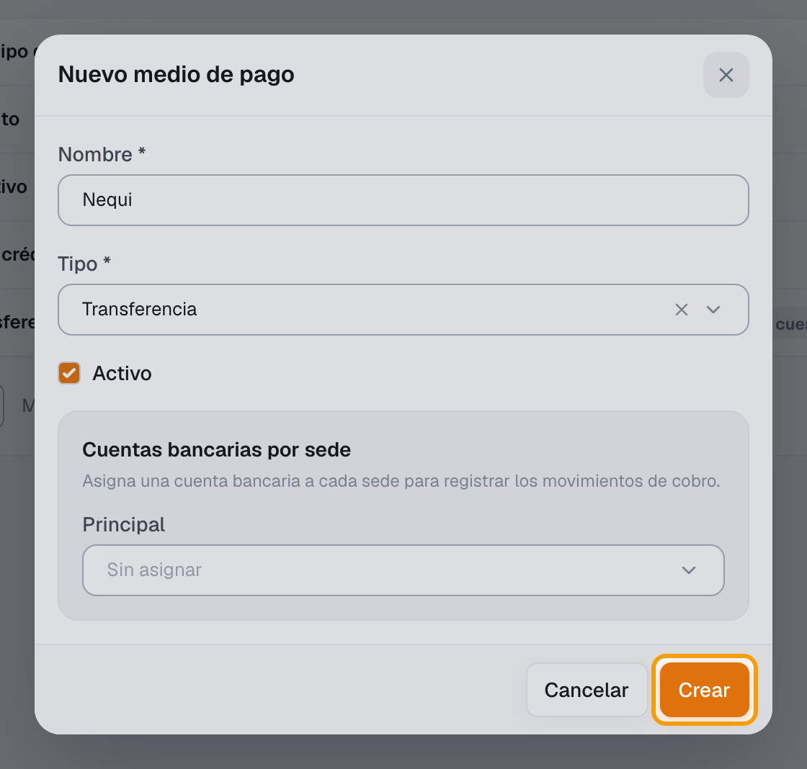
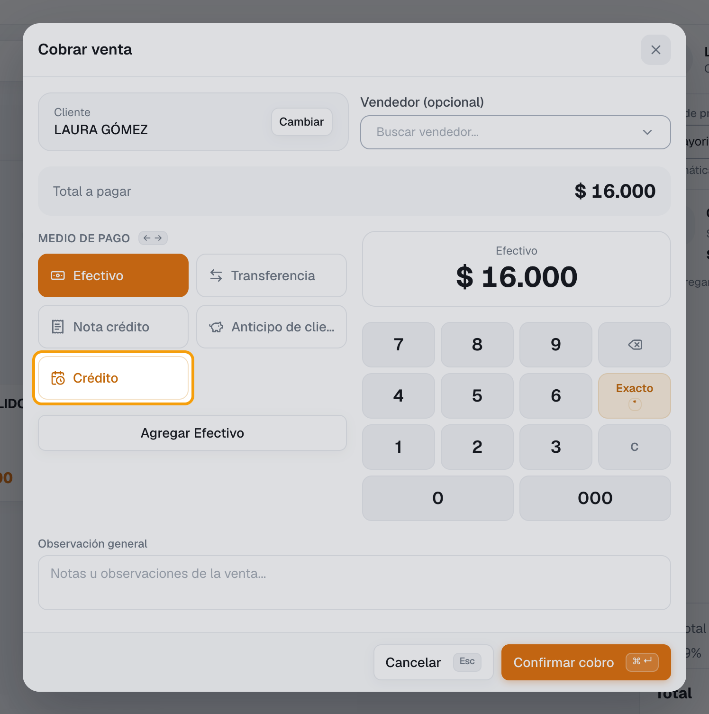

# ¿Cómo creo un medio de pago y por qué no me sale Crédito en el POS?

También se busca como: medio de pago, forma de pago, agregar medio de pago, Nequi, Daviplata, datáfono, tarjeta, transferencia, vender a crédito, fiado, crédito en el POS, no aparece crédito, cupo del cliente.

**Qué es:** las opciones con las que te pagan en el POS y en las facturas. Inventy ya trae **Efectivo**, **Transferencia**, **Crédito**, **Anticipo de cliente** y **Nota crédito**: solo creas los adicionales (ej. *Nequi*, *Datáfono Bancolombia*).

!!! info "¿Quieres vender a crédito?"
    **No crees un medio de pago Crédito:** ya existe y solo puede haber uno. Para que aparezca al cobrar, mira [¿Por qué no me sale Crédito en el POS?](#por-que-no-me-sale-credito-en-el-pos).

**Antes de empezar:** para transferencias y tarjetas, crea la cuenta bancaria donde entra el dinero en Tesorería › Cuentas bancarias.

## Pasos

**Paso 1.** Ingresa a Ventas › Ajustes › Medios de Pago y haz clic en **Nuevo medio de pago**.

**Paso 2.** Escribe el **Nombre** (ej. *Nequi*) y elige el **Tipo**: **Transferencia**, **Tarjeta de crédito** o **Tarjeta débito**. Deja marcado **Activo**.

**Paso 3.** En **Cuentas bancarias por sede**, elige la cuenta de cada sede, o usa **Aplicar a todas las sedes**.

**Paso 4.** Haz clic en **Crear**.

**Paso 5.** En el POS, al hacer clic en **Realizar venta**, el nuevo medio aparece en **Medio de pago** de la ventana **Cobrar venta**.

✅ **Listo:** el medio queda disponible en el POS y en las facturas de venta.

## ¿Por qué no me sale Crédito en el POS?

**Crédito** solo aparece en **Cobrar venta** cuando se cumplen las tres:

| Requisito | Dónde se revisa |
|---|---|
| Elegiste un **cliente** en la venta | En el POS, debajo del pedido. Sin cliente no se ofrece crédito. |
| El cliente tiene **Límite de crédito (COP)** mayor que 0 | Configuración › Contactos › el contacto › pestaña **Rol Cliente**. Ver [rol de cliente](rol-de-cliente.md). También sirve activar **Crédito ilimitado para clientes** o **Requerir autorización para cupo de crédito adicional** en Configuración › Módulos › Ventas. |
| El medio **Crédito** está **Activo** | Ventas › Ajustes › Medios de Pago. Si dice *Inactivo*, actívalo. |

Al elegirlo verás el **Cupo disponible** del cliente. Si el saldo a crédito lo supera, el POS no deja confirmar (salvo que la empresa use la autorización del supervisor).

## Si algo falla

| Problema | Solución |
|---|---|
| No aparece **Cuentas bancarias por sede** | Solo lo piden **Transferencia**, **Tarjeta de crédito** y **Tarjeta débito**. |
| *Ya existe un medio de pago de tipo Crédito. Solo puede haber uno.* (o de tipo Efectivo) | Ya existe: no hace falta crearlo. |
| *Este medio de pago lo crea el sistema.* | **Anticipo de cliente** y **Nota crédito** los crea Inventy. |
| **Crédito** o **Efectivo** no tienen **Editar** ni **Eliminar** | Son medios del sistema: solo se pueden **Desactivar**. |
| *Este cliente no tiene cupo de crédito asignado. Configúralo antes de facturar a crédito.* | Ponle **Límite de crédito (COP)** en su **Rol Cliente**. |
| *El cliente no tiene cupo disponible suficiente para esta factura a crédito.* | Cobra una parte con otro medio o pide que paguen lo pendiente. |
| *No hay medios de pago configurados…* | Ver [No aparecen los medios de pago](../soluciones-rapidas/pos-caja.md#no-aparecen-los-medios-de-pago). |

## Relacionados

- [¿Para qué sirve el rol de cliente y cuál elijo?](rol-de-cliente.md)
- [¿Cómo vendo en el POS?](../pos/vender-en-pos.md)
- [¿Qué es un anticipo y cómo se maneja en Inventy?](../finanzas/anticipos.md)
