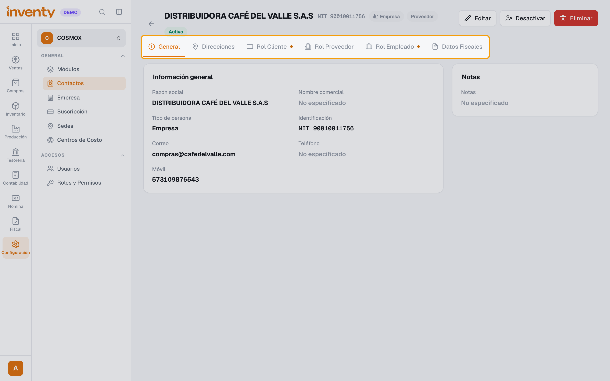
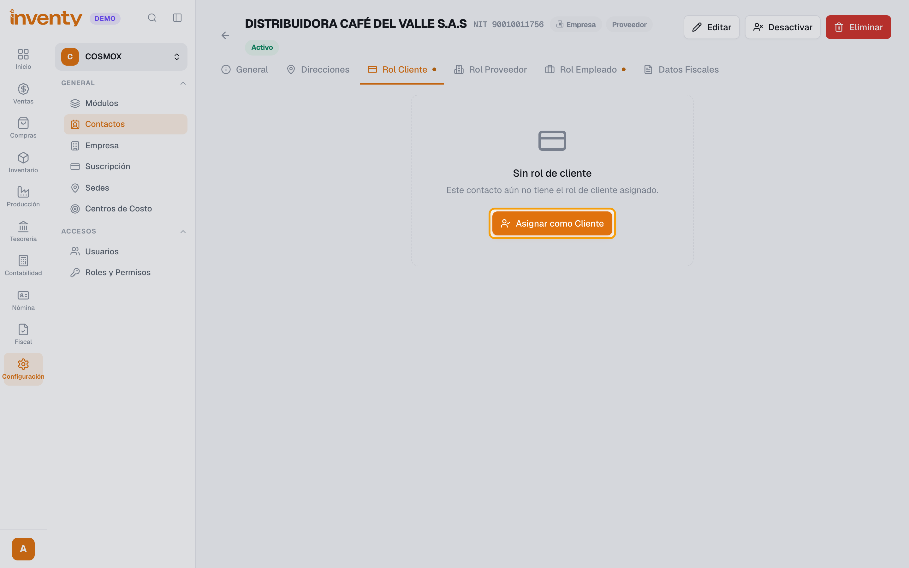
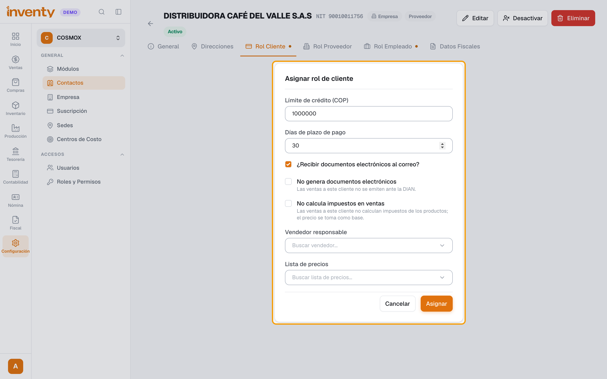
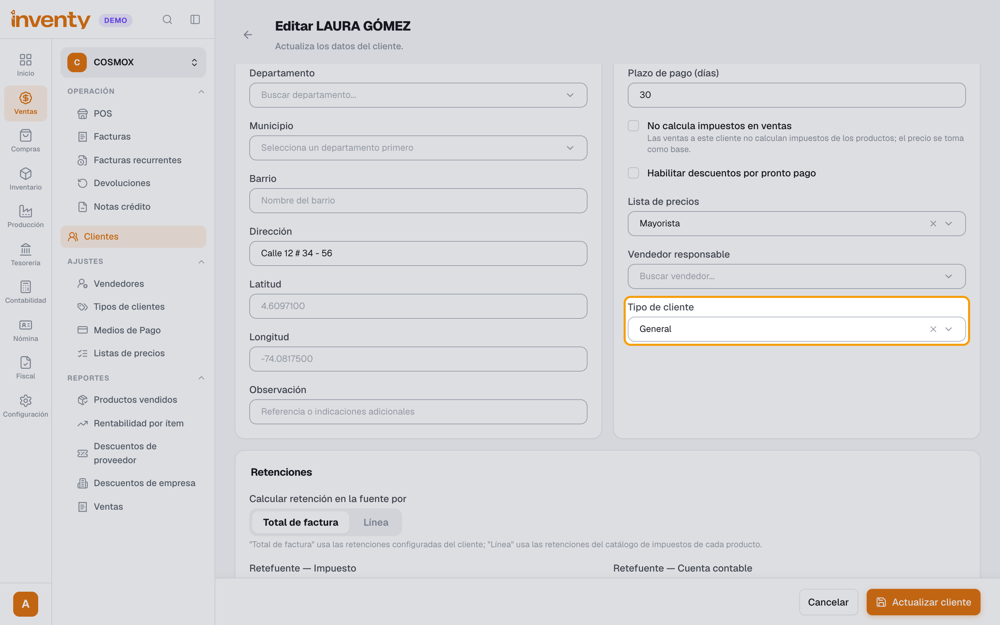

# ¿Para qué sirve el rol de cliente y cuál elijo?

También se busca como: rol de cliente, rol de proveedor, rol de empleado, contacto, tercero, proveedor que también es cliente, convertir proveedor en cliente, tipo de cliente, cuál tipo de cliente elijo.

**Qué es:** cada persona o empresa se crea **una sola vez** como **contacto**. El **rol** dice qué relación tiene contigo y en qué pantallas aparece:

| Rol | Para qué | Dónde aparece |
|---|---|---|
| **Rol Cliente** | Para **venderle** | Ventas › Clientes, buscador de cliente del POS y de facturas de venta, cartera, recaudos |
| **Rol Proveedor** | Para **comprarle** | Compras › Proveedores, facturas de compra, pagos (egresos) |
| **Rol Empleado** | Para **pagarle nómina** | Módulo de Nómina |

**¿Cuál elijo?** El de lo que haces con él: le vendes → **Cliente**; le compras → **Proveedor**; trabaja contigo → **Empleado**. Puede tener **varios** a la vez (ej. un proveedor que también te compra).

Al crear un cliente en Ventas › Clientes o un proveedor en Compras › Proveedores, el rol se asigna solo. Los pasos de abajo son para **agregarle otro rol** a alguien que ya existe.

## Pasos

**Paso 1.** Ingresa a Configuración › Contactos y abre el contacto. Arriba ves sus pestañas: **Rol Cliente**, **Rol Proveedor** y **Rol Empleado**.

**Paso 2.** Abre **Rol Cliente**. Si aún no lo tiene, haz clic en **Asignar como Cliente**.

**Paso 3.** Completa los datos y haz clic en **Asignar**:

- **Límite de crédito (COP)**: con **0 no se le puede vender a crédito**.
- **Días de plazo de pago**: cuántos días tiene para pagar.
- **¿Recibir documentos electrónicos al correo?**: si le llegan las facturas electrónicas.
- **No genera documentos electrónicos**: sus ventas no se envían a la DIAN.
- **No calcula impuestos en ventas**: para clientes exentos (el precio se toma sin impuestos).
- **Vendedor responsable** y **Lista de precios**: opcionales.

**Paso 4.** Ponle el **Tipo de cliente** (este formulario no lo pide): en Ventas › Clientes abre el cliente, haz clic en **Editar**, elige el **Tipo de cliente** y haz clic en **Actualizar cliente**.

✅ **Listo:** ya puedes venderle. Si también es proveedor, puedes [compensar sus cuentas](../finanzas/compensacion-cuentas.md).

!!! tip "¿Qué tipo de cliente elijo?"
    - **General**: para la mayoría. Viene creado y trae la cuenta por cobrar *130505001 Clientes nacionales*.
    - **Otro tipo** (ej. *Mayorista*): solo si ese grupo necesita un **% de descuento** automático o una **cuenta por cobrar distinta**. Ver [¿Cómo creo un tipo de cliente?](tipos-de-cliente.md).

    El **rol** dice si le vendes; el **tipo** clasifica a quién le vendes. Si usas Contabilidad, **todo cliente a crédito necesita tipo de cliente**.

## Si algo falla

| Problema | Solución |
|---|---|
| El cliente no aparece al buscarlo en el POS o en la factura | No tiene **Rol Cliente**: asígnalo (pasos 1 a 3). |
| El proveedor no aparece en la factura de compra | No tiene **Rol Proveedor**: asígnalo en su pestaña **Rol Proveedor**. |
| *El saldo a crédito supera el cupo disponible del cliente…* | Sube el **Límite de crédito** (con 0 no tiene crédito). |
| Al vender a crédito: *Configura una cuenta de cuentas por cobrar en el tipo de cliente…* | Falta el paso 4. Ver la [solución](../soluciones-rapidas/ventas.md#al-validar-la-factura-a-credito-me-pide-configurar-la-cuenta-contable). |
| *Este número de documento ya está registrado para este tipo de identificación.* | Ese tercero ya existe como contacto: no lo crees de nuevo, agrégale el rol (pasos 1 a 3). |

## Relacionados

- [¿Cómo creo un cliente?](crear-cliente.md)
- [¿Cómo creo un tipo de cliente?](tipos-de-cliente.md)
- [¿Cómo creo un proveedor?](../compras/crear-proveedor.md)
- [¿Cómo hago una compensación de cuentas?](../finanzas/compensacion-cuentas.md)
