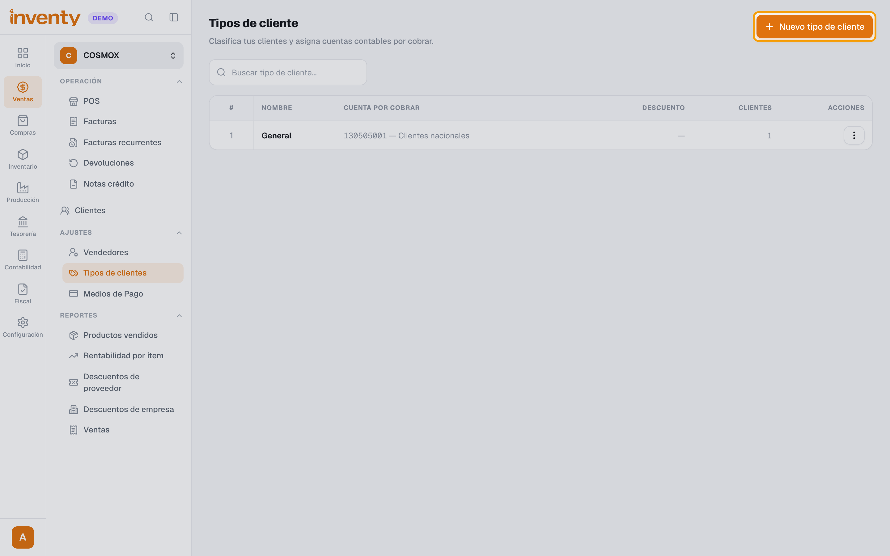
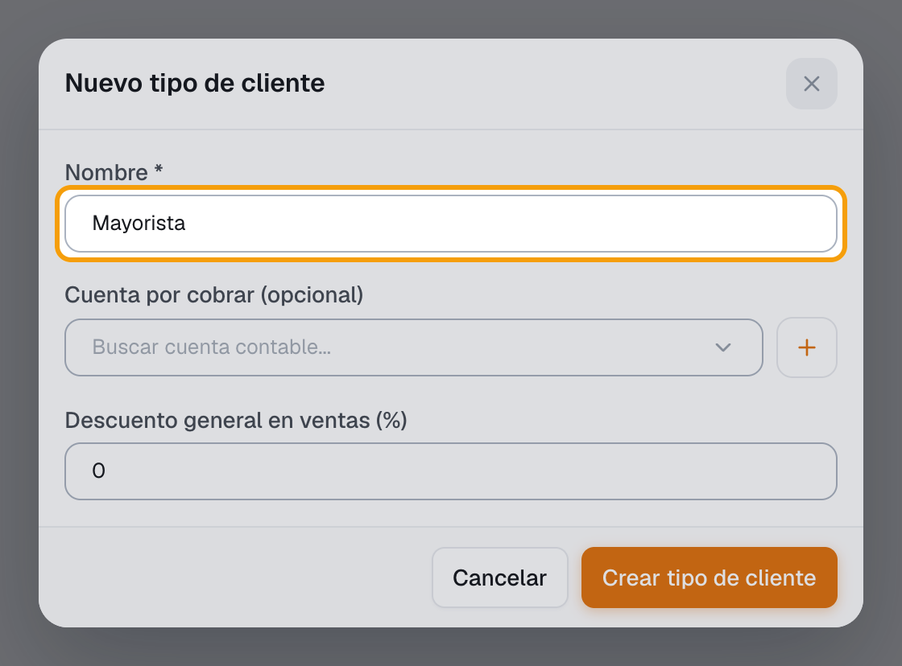
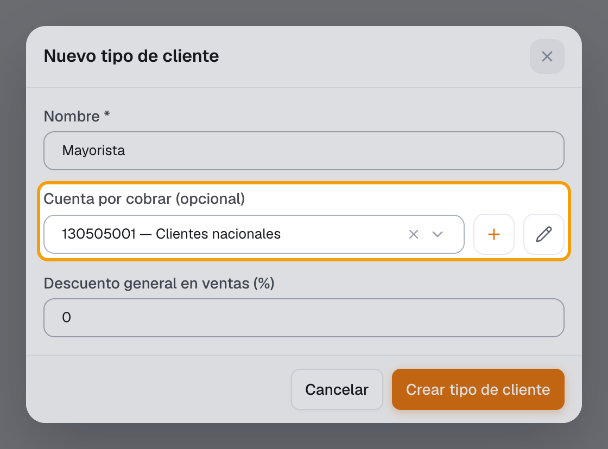
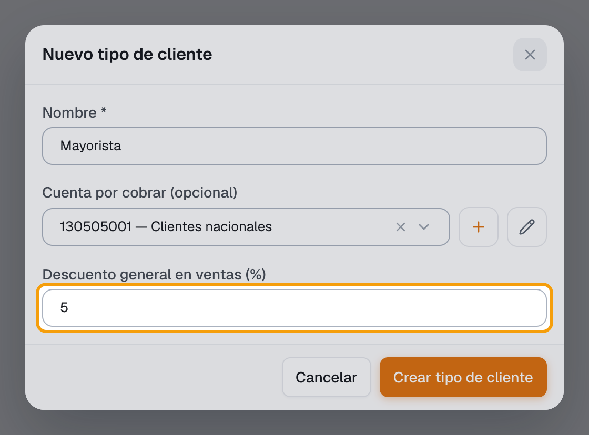
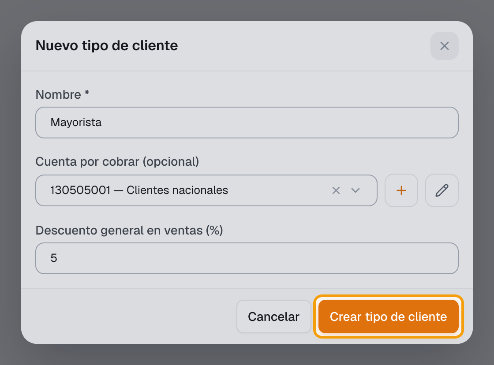
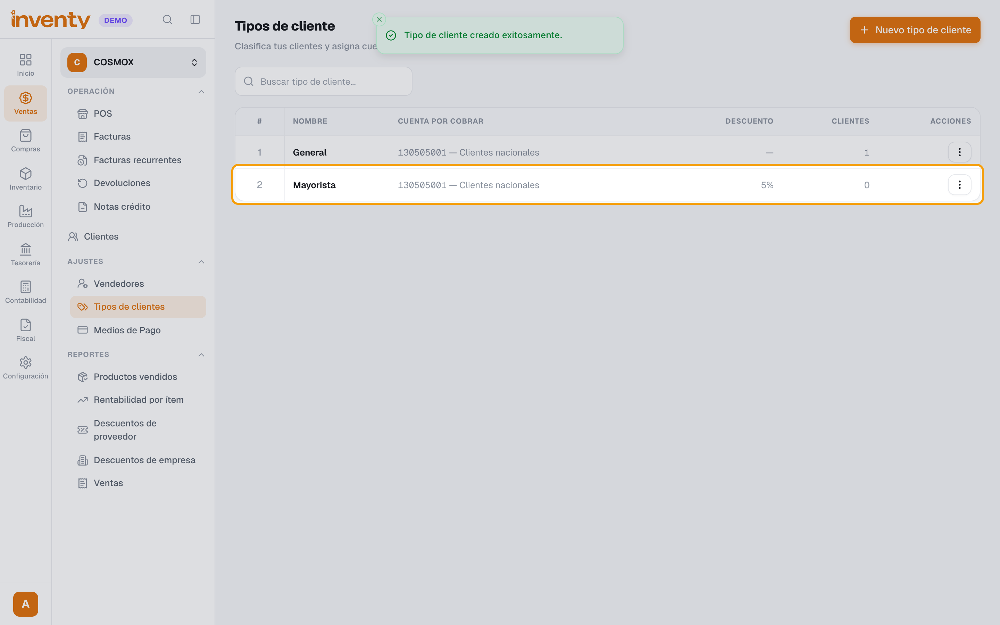

# ¿Cómo creo un tipo de cliente?

También se busca como: tipo de cliente, clasificar clientes, mayorista, minorista, descuento por tipo de cliente, cuenta por cobrar, cartera, cliente a crédito.

**Qué es:** una clasificación de clientes (mayorista, minorista…) que define **a qué cuenta va su cartera** y si tienen un **descuento general**. Inventy trae el tipo *General*.

## Pasos

**Paso 1.** Ingresa a Ventas › Ajustes › Tipos de clientes y haz clic en **Nuevo tipo de cliente**.

**Paso 2.** Escribe el **Nombre** (ej. *Mayorista*).

**Paso 3.** Elige la **Cuenta por cobrar** (ej. *130505001 — Clientes nacionales*). Es obligatoria para vender a crédito si usas Contabilidad.

**Paso 4.** (Opcional) Escribe el **Descuento general en ventas (%)** que tendrán estos clientes.

**Paso 5.** Haz clic en **Crear tipo de cliente**.

**Paso 6.** Asígnalo a cada cliente en su ficha: **Datos del rol de cliente › Tipo de cliente**.

✅ **Listo:** las ventas a crédito de esos clientes registran la cartera en la cuenta elegida y aplican su descuento.

## Si algo falla

| Problema | Solución |
|---|---|
| Al facturar a crédito: *Configura la cuenta por cobrar en el tipo de cliente* | El cliente no tiene tipo, o su tipo no tiene **Cuenta por cobrar**. Asígnale uno con cuenta. |
| No aparece la cuenta para elegir | Carga primero las [cuentas auxiliares por defecto](../contabilidad/cuentas-auxiliares.md). |
| El descuento no se aplica en el POS a un producto | Si el cliente tiene descuento por tipo, no se puede poner además un descuento manual en esa línea. |

## Relacionados

- [¿Cómo creo un cliente?](crear-cliente.md)
- [¿Cómo hago una factura de venta?](crear-factura-venta.md)
- [¿Cómo manejo las listas de precios?](listas-de-precios.md)
